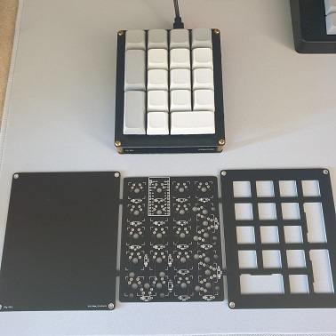

# flip
A numpad that can be assembled upside down (if you want) for a reversed numpad layout

Currently only a FR4 sammich case but there might be a 3D printed case at some point

CAD stuff done in [KiCad](https://www.kicad.org/)

[Firmware](https://github.com/garymevs/vial-qmk)
